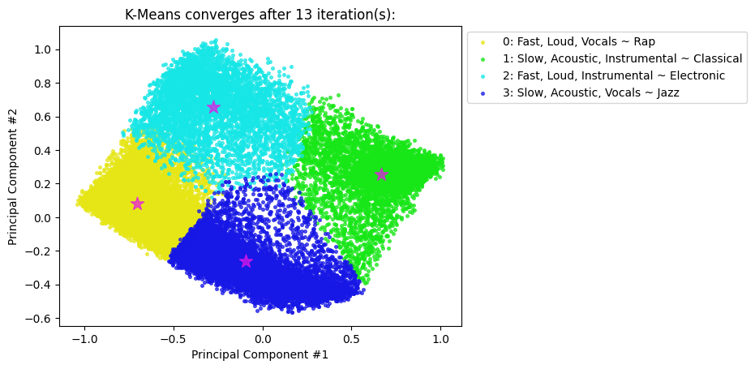
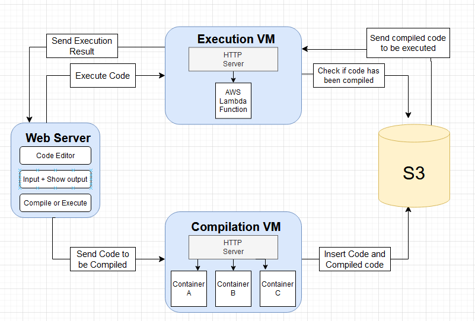
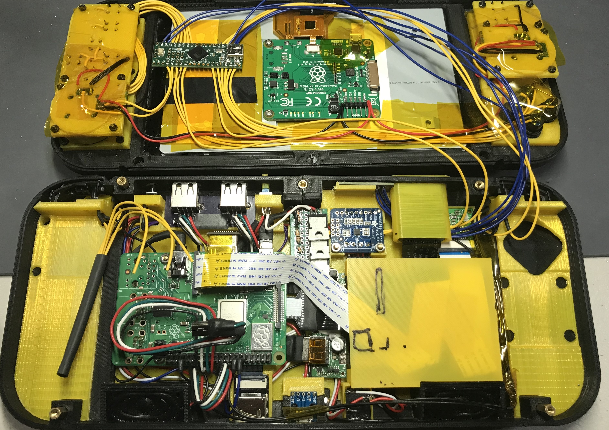

# Introduction

My name is **Nolan Anderson**! I am a graduate student studying Computer Science and Engineering at Santa Clara University. If you want to know more about me, consider checking out my [LinkedIn page](https://www.linkedin.com/in/nolanranderson/).

Anyways, this document summarizes the majority of the projects I have worked on in my free time, at work, and during my school experience. I hope you find it insightful.

# Personal Projects

## SoundSwitch
- **Skills:** backend development, databases, data analysis
- **Technologies:** Python, Django, Postgres, Dart, Flutter
- Working on a generalized program to manage music playlist metadata from multiple platforms and services: Spotify, Deezer, etc.
- Working on converting playlists between platforms
- Frontend in Flutter for multi-platform support (Web, Windows, Android, etc.)
- Backend in Django for database management
- Custom backend API (includes modules for the various platforms) 

## myAPI / "The Remote"
- **Skills:** backend development, reverse engineering
- **Technologies:** C#, JavaScript, HTML, CSS
- Implemented my own API (like a home-grown Home Assistant) and made a simple web UI to interact with it.
- Implemented control for JVC projectors, Yamaha receivers, Kodi instances, Daikin air conditioners, miniDSP hardware, and more.
- Added additional functionality to combine actions in a repeatable way (e.g. no out of sync actions due to toggle).
- Used WireShark to sniff local network traffic

## Game Catalog
- **Skills:** web scraping, database
- **Technologies:** C#, .NET Framework, SQLite
- Designed a program to manage game databases for a variety of different video game consoles
- Allows searching for specific game tiles, sorting by region, viewing cover art, etc.

## autoBEQ
- **Technologies:** Python
- Created a script to automatically apply [BEQ (Bass EQ) filters](https://beqdesigner.readthedocs.io/en/latest/#:~:text=Bass%20EQ%20(BEQ)%20is%20a%20term%20coined%20on%20data%2Dbass%20in%202014%20to%20describe%20a%20method%20for%20recovering%20low%20frequency%20content%20that%20has%20been%20filtered%20out%20during%20post%20production%20of%20the%20mix.) to a MiniDSP based on the currently playing content, leveraging the [ezbeq](https://ezbeq.readthedocs.io/en/latest/#overview) API
- Selects best BEQ filter based on the audio codec of the playing content (e.g. DTS, Dolby Atmos, etc.)

## Spotify Clients
- **Technologies:** C, C++, Python
- I implemented features of the Spotify API in multiple programming languages to bolster my REST API skills in each language.

## Other Notable Python Scripts
- **Technologies:** Python
- Script to verify FLAC files using [flac.exe](https://xiph.org/flac/index.html)
- Script to select source of a multi-port HDMI switch over TCP
- Script to control LED light strips over UDP (CircuitPython script running on ESP32)
- Script to sync volume and power state of two AV receivers for multi-room audio
- Loads more

# Work Projects
## Hospital Scheduling System
- **Role:** Software Engineer @ SCU Frugal Innovation Hub (2024)
- **Technologies:** Dart, Flutter, Firebase
- Volunteered my time to help develop a hospital scheduling system for use in Senegal, collaborating with the non-profit Sayap Africa

## Currency Activation Tool
- **Role:** Intern @ Zoom Communications (2022)
- **Technologies:** JavaScript
- Streamlined new currency launch process by designing an easy-to-use JavaScript tool, ultimately increasing efficiency by 20%

## Test Automation Framework
- **Role:** Intern @ Zoom Communications (2021)
- **Technologies:** Java
- Improved quality assurance processes by developing a Java-based flexible test automation framework, allowing previously manual testing to be done automatically

# University Projects

## Deep (Dive Into) Clustering
- **Subject:** Deep Learning (CSEN 342)
- **Technologies:** Python, PyTorch
- Worked on enhancing a deep clustering method, [DECCS](https://arxiv.org/abs/2210.07063)
- Performed a variety of experiments: introduced quantization, added noise, added convolutional layers, trained the autoencoder from scratch, etc.
- Worked with common datasets like MNIST

## Latent Lyrics Modeling
- **Subject:** Natural Language Processing (CSEN 346)
- **Technologies:** Python, NumPy, Pandas, NLTK
- Applied sentiment classification on song lyrics using multiple methods:
    - "NolanNet" → fully-connected neural network for logistic regression
    - VADER → rule-based sentiment analyzer from NLTK
    - BERT-based → transformer-based encoder from Hugging Face
- Uncovered correlations between sentiment data for a given year and economic and crime data for that same year

## Music Genre Classification
- **Subject:** Machine Learning (CSEN 240)
- **Technologies:** Python, NumPy, Pandas, Matplotlib

- Used audio features to produce a genre group label
    - acousticness, danceability, energy, instrumentalness, loudness, and valance
- Leveraged K-Means with 50,000 samples
- Applied my own labels to the generated clusters based upon centroid characteristics
- Tested different numbers of clusters using Inertia as my evaluation metric
- Discovered clear 4 genre groupings
- Used Principal Component Analysis (PCA) to plot (see below)

## Gossip Simulator
- **Subject:** Distributed Systems (CSEN 317)
- **Technologies:** Python, Docker
- Implemented reliable gossip communication between multiple, replicated Docker containers
- Supports changing of message groups
- Conducts automatic leader election upon failure

## Online C Compiler
- **Subject:** Cloud Computing (CSEN 241)
- **Technologies:** Docker, Python, JavaScript

- Developed an extensible online C compiler using AWS infrastructure
    - Used containerization, virtual machines (EC2), serverless functions (Lambda), and object storage (S3)
- Supports multiple compiler and compiler versions (gcc, clang, etc.) for easy testing
- Compilation occurs in containers, object storage holds the executables, execution occurs via Lambda functions

## Play to Code
- **Subject:** Undergraduate Senior Project (CSEN 194-196)
- **Technologies:** Vue.js, JavaScript, PHP, SQL, Godot
- Constructed a full-stack application to teach children to code
- Developed interactive games with Godot, the open source game engine
- Deployed application to the cloud
- Presented to a panel of judges knowledgeable in the field

## Aggregate Gamer-score
- **Subject:** Software Engineering (CSEN 174)
- **Technologies:** Vue.js, JavaScript, Python
- Compute aggregate gamer-score (a unique metric based on your gaming prowess) using connected accounts
    - Connect to your Chess.com, PlayStation, Steam, and Xbox accounts

# High School Projects

## Port-a-Pi Handheld
- **Skills:** planning, construction, soldering, scripting
- **Subject:** Senior Project
- **Technologies:** Bash, Python, C
- Constructed a Raspberry Pi-based handheld device
- Integrated camera allows for QR-code based parental control using my custom scripts
- Integrated Teensy micro-controller allows for customizable button mappings (Programmed with C in the Arduino IDE)
- Handheld device also includes integrated controller, battery, touchscreen, speakers, etc.
- Presented to a panel of judges knowledgeable in the field

